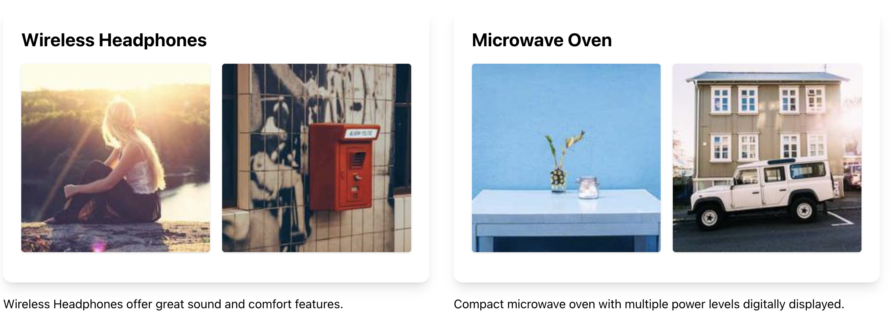

# Neurify

```
const PRODUCTS = [
  {
    id: 1,
    name: "Wireless Headphones",
    description:
      "High-quality wireless headphones with noise cancellation and long battery life.",
    price: 99.99,
    category: "Electronics",
    stock: 150,
    rating: 4.5,
    reviews: [
      { user: "Alice", comment: "Great sound quality!", rating: 5 },
      { user: "Bob", comment: "Very comfortable to wear.", rating: 4 },
    ],
    features: [
      "Bluetooth 5.0",
      "Active Noise Cancellation",
      "20-hour Battery Life",
      "Built-in Microphone",
    ],
    images: ["https://picsum.photos/200/", "https://picsum.photos/201/"],
    brand: "SoundMagic",
    model: "SM-1000",
    warranty: "2 years",
    releaseDate: "2023-01-15",
  },
  {
    id: 2,
    name: "Microwave Oven",
    description:
      "Compact microwave oven with multiple power levels and a digital display.",
    price: 79.99,
    category: "Home Appliances",
    stock: 80,
    rating: 4.2,
    reviews: [
      { user: "Charlie", comment: "Heats food quickly.", rating: 4 },
      { user: "Dana", comment: "Easy to use and clean.", rating: 5 },
    ],
    features: [
      "700 Watts Power",
      "10 Power Levels",
      "Digital Display",
      "Child Lock Feature",
    ],
    images: ["https://picsum.photos/202/", "https://picsum.photos/203/"],
    brand: "KitchenPro",
    model: "KP-700",
    warranty: "1 year",
    releaseDate: "2022-11-20",
  },
];

export default component$(() => {
  return (
    <>
      <AILayout>
        <div class="flex w-full flex-row">
          {PRODUCTS.map((product) => (
            <div class="w-1/3 p-4">
              <div class="flex flex-col gap-4">
                <AIComponent
                  class="w-full"
                  intent="Show only title and images"
                  data={product}
                />
                <AIText
                  intent="summarize in one sentence, max 20 words, min 10 words"
                  of={product}
                />
              </div>
            </div>
          ))}
        </div>

        <div class="m-4"></div>
      </AILayout>
    </>
  );
});
```


